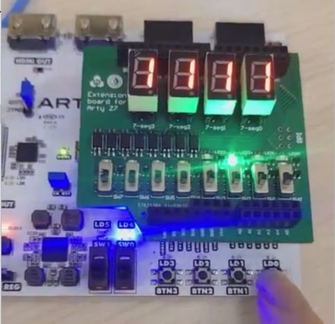

# Ổ Khóa Điện Tử Sử Dụng FPGA Arty-Z7

## Giới Thiệu
Dự án đồ án thiết kế luận lý của nhóm thực hiện tại Trường Đại Học Bách Khoa Tp.HCM nhằm phát triển một hệ thống ổ khóa điện tử hiện đại. Hệ thống này sử dụng FPGA Arty-Z7 kết hợp với phần mềm Vivado để thực hiện các chức năng nhập và xác thực mật khẩu, điều khiển mở/đóng cửa và cảnh báo an ninh.

## Công Cụ và Thiết Bị Sử Dụng
- **FPGA Arty-Z7**: Nền tảng chính xử lý tín hiệu và logic.
- **Phần mềm Vivado**: Hỗ trợ thiết kế, mô phỏng và triển khai dự án.
- **Bàn phím ma trận & 4 nút bấm**: Nhập, chuyển đổi và xác nhận mật khẩu.
- **Đèn LED 7-Segment**: Hiển thị các ký tự mật khẩu.
- **Công tắc & LED báo trạng thái**: Theo dõi trạng thái cửa và hệ thống cảnh báo.

## Chức Năng Chính
- **Nhập & Xác Thực Mật Khẩu**: Cho phép người dùng nhập mật khẩu 4 ký tự (0-9, A-F) và so sánh với mật khẩu lưu sẵn.
- **Điều Khiển Cửa**: Mở cửa khi mật khẩu chính xác; tự động khóa nếu không có thao tác mở cửa đúng thời gian.
- **Cảnh Báo An Ninh**: Phát tín hiệu cảnh báo qua đèn LED khi nhập sai mật khẩu quá nhiều lần hoặc cửa không đóng đúng thời gian.
- **Thay Đổi Mật Khẩu**: Cho phép thay đổi mật khẩu sau xác thực ban đầu.

## Thiết Kế & Hiện Thực
- **Kiến Trúc Hệ Thống**: Hệ thống được chia thành các khối chức năng độc lập như:
  - **Nhập liệu**: Xử lý tín hiệu từ các nút bấm và hiển thị qua LED 7-Segment.
  - **Quản lý mật khẩu**: So sánh, xác thực và lưu trữ mật khẩu.
  - **Cảnh báo**: Theo dõi trạng thái cửa và kích hoạt cảnh báo khi cần.
  - **Quản lý cửa & xử lý khóa**: Điều khiển trạng thái mở/đóng cửa, xử lý khóa hệ thống khi nhập sai mật khẩu.
  - **Khối tổng hợp**: Điều phối các khối chức năng, đảm bảo xử lý tín hiệu và đồng bộ hệ thống.
- **Lập Trình HDL (Verilog)**: Triển khai logic hệ thống và mô phỏng trên FPGA.
- **Xử Lý Tín Hiệu & Khử Nhiễu**: Đảm bảo độ ổn định cho dữ liệu đầu vào từ các nút bấm và công tắc.

## Kết Luận & Hướng Phát Triển
- **Kết Luận**: Hệ thống ổ khóa điện tử đã đáp ứng đầy đủ các yêu cầu về bảo mật, điều khiển và cảnh báo, hoạt động ổn định trên nền tảng FPGA Arty-Z7.
- **Hướng Phát Triển**:
  - Mở rộng hiển thị ký tự từ 0-F.
  - Tích hợp giao diện VGA để hiển thị trạng thái hệ thống.
  - Nâng cao bảo mật với thuật toán mã hóa (AES, SHA) và xác thực hai yếu tố.
  - Kết nối IoT để điều khiển từ xa và gửi cảnh báo qua thiết bị di động.
## Demo

## Liên Hệ
Nếu có thắc mắc hoặc góp ý, vui lòng liên hệ với nhóm thực hiện.
